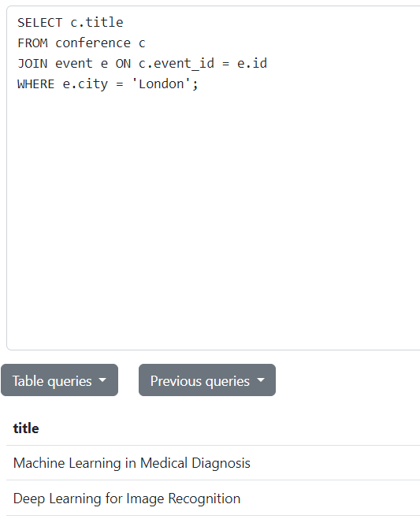
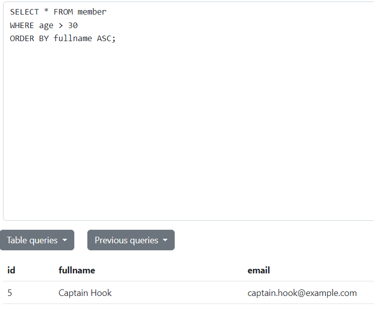
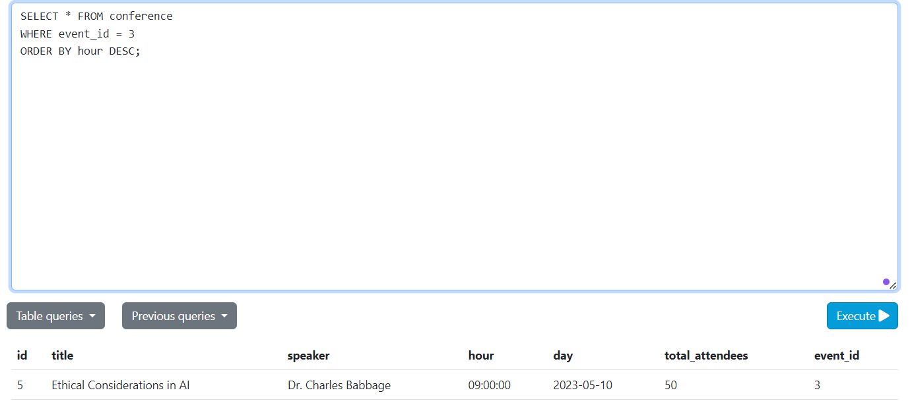
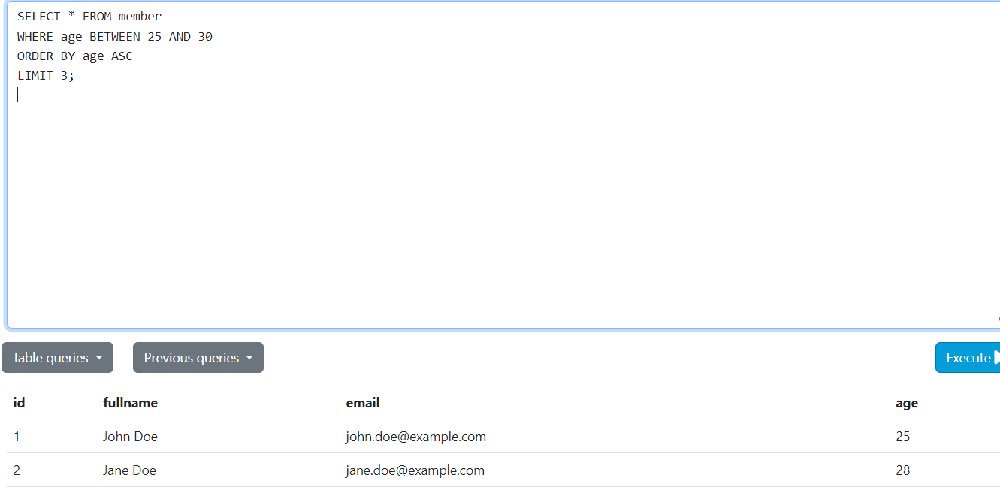

# Tarea - Events
 __script DDL__
```
CREATE TABLE member (

  id INT PRIMARY KEY,

  fullname VARCHAR(255),

  email VARCHAR(255) UNIQUE,

  age INT
);

CREATE TABLE event (

  id INT PRIMARY KEY,

  description VARCHAR(255),

  start_date DATE,

  end_date DATE,
  total_attendees INT,

  city VARCHAR(255)
);

CREATE TABLE conference (

  id INT PRIMARY KEY,

  title VARCHAR(255),

  speaker VARCHAR(255),

  hour TIME,

  day DATE,

  total_attendees INT,

  event_id INT,

  FOREIGN KEY (event_id) REFERENCES event(id)
);

CREATE TABLE register (

  id INT PRIMARY KEY,

  member_id INT,

  conference_id INT,

  code VARCHAR(255) UNIQUE,

  registered_at DATE,

  assisted BOOLEAN,

  FOREIGN KEY (member_id) REFERENCES member(id),

  FOREIGN KEY (conference_id) REFERENCES conference(id)
);
```


## 1.  Obtener los asistentes a la conferencia "The Future of AI"
 - Sentencia:
  ```
 SELECT m.fullname
FROM member m
JOIN register r ON m.id = r.member_id
JOIN conference c ON r.conference_id = c.id
WHERE c.title = 'The Future of AI';
  ```
  - Captura:
  

## 2. Obtener las conferencias que se desarrollarán en Londres
 - Sentencia:
  ```
 SELECT c.title
FROM conference c
JOIN event e ON c.event_id = e.id
WHERE e.city = 'London';
  ```
  - Captura:
  

 ## 3.Seleccionar todos los integrantes con edad mayor a 30 años, ordenados por nombre completo en orden ascendente.
  - Sentencia:
  ```
 SELECT * FROM member
WHERE age > 30
ORDER BY fullname ASC;

  ```
  - Captura: 
  
  
## 4.Seleccione todas las conferencias cuyo evento esté asociado al evento con ID 3 y ordenarlas por hora en orden descendente
 - Sentencia:
  ```
 SELECT * FROM conference
 WHERE event_id = 3
 ORDER BY hour DESC;

 ```
 - Captura:

 

## 5.Seleccione todos los miembros cuya edad esté entre 25 y 30 años, ordenarlos por edad de forma ascendente

 - Sentencia:
  ```
 SELECT * FROM member
WHERE age BETWEEN 25 AND 30
ORDER BY age ASC
LIMIT 3;
 ```
 - Captura:
 
 


 
